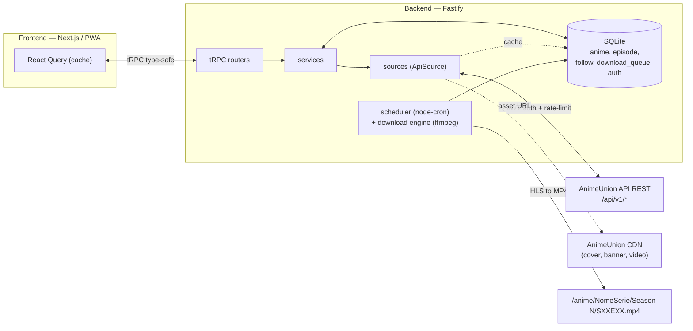

# Architettura — AnimeUnion Docker

## Visione

Applicazione Docker self-hosted che, integrata ufficialmente con
[AnimeUnion](https://animeunion.tv), automatizza il download degli anime con file
rinominati e organizzati per Jellyfin e Plex.

Il container serve principalmente ad **automatizzare il download**: l'utente segue
un anime e ogni nuovo episodio viene scaricato automaticamente, un episodio alla volta.

## Monorepo (3 workspace npm)

```
animeunion/
├── packages/shared   # Tipi zod + interfaccia AnimeSource (zero runtime pesante)
├── apps/api          # Backend Fastify + tRPC + Drizzle (SQLite)
└── apps/web          # Frontend Next.js 15 + shadcn/ui (PWA)
```

- **`packages/shared`** — single source of truth dei tipi scambiati client↔server.
  Gli schemi `zod` vivono qui e vengono importati sia dal backend (validazione input)
  sia dal frontend (type safety). Contiene anche l'interfaccia `AnimeSource`.
- **`apps/api`** — espone tRPC su Fastify. Struttura a livelli: **routers → services → sources**.
  I `sources` sono l'unico punto che parla con AnimeUnion.
- **`apps/web`** — consuma il backend solo via tRPC (zero `fetch`/`axios` diretti).

## Flusso dati



**Regola cardinale**: il frontend **non** chiama mai direttamente AnimeUnion.
Ogni richiesta passa dal backend, che fa da **proxy + cache + rate-limit**.

## L'interfaccia `AnimeSource`

Tutta la comunicazione con AnimeUnion passa da un'unica interfaccia con
implementazioni intercambiabili (definita in `packages/shared/src/anime-source.ts`):

| Implementazione | Ruolo |
|---|---|
| `ApiSource` | **Primaria (produzione)** — REST API ufficiali con JWT auth |
| `ScraperSource` | Fallback — parsa `__data.json` di SvelteKit se l'API è down |
| `MockSource` | Solo CI/test offline — dataset fittizio, mai in produzione |

## Autenticazione

Login **obbligatorio** verso AnimeUnion. Le credenziali (email/password) stanno
nel `.env` (mai committato); i token (access + refresh) vengono salvati in SQLite
(tabella `auth`) e refreshati automaticamente. Vedi `docs/API_ANIMEUNION.md`.

## Persistenza

SQLite via Drizzle ORM è una **cache locale del catalogo AnimeUnion** più i **dati
locali** (watchlist, coda download, config, token). Tabelle: `anime`, `genre`,
`anime_genre`, `episode`, `follow`, `download_queue`, `config`, `stats`, `auth`.

## Rate limiting

- Cache locale SQLite per ogni richiesta di catalogo.
- Throttle: max 1 richiesta API/secondo (configurabile, token bucket).
- Sync catalogo periodico (default 24h), non a ogni richiesta utente.
- Auto-download: controllo nuovi episodi ogni 6–12h, solo per anime seguiti.
